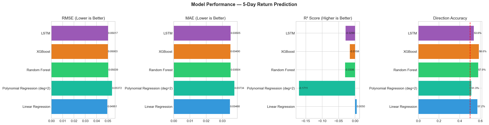
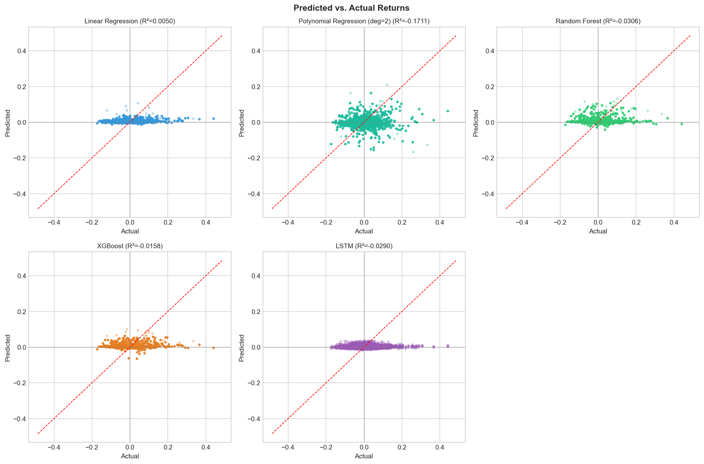
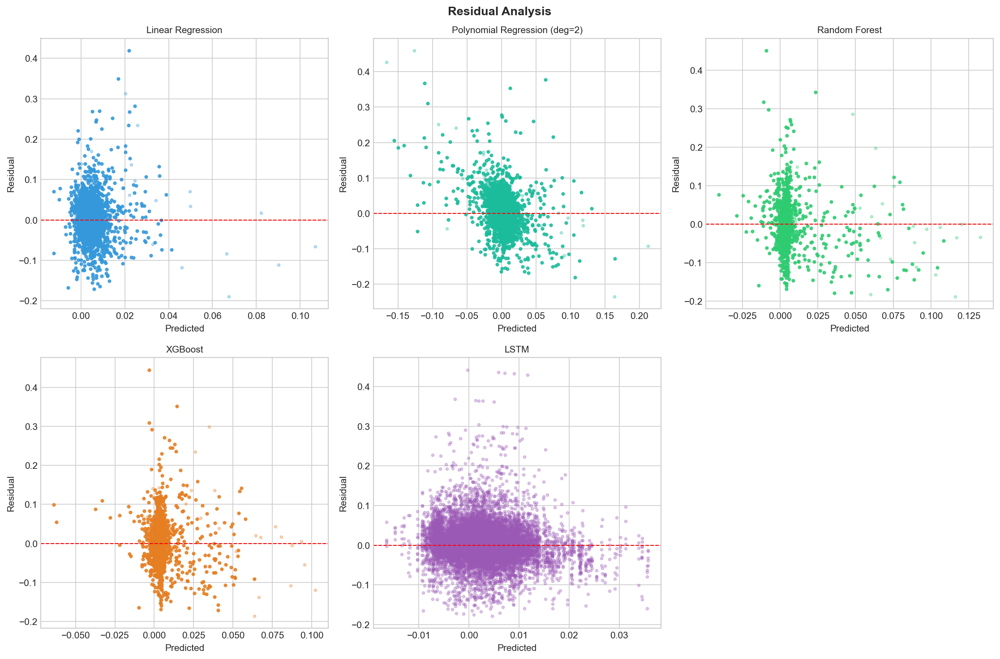
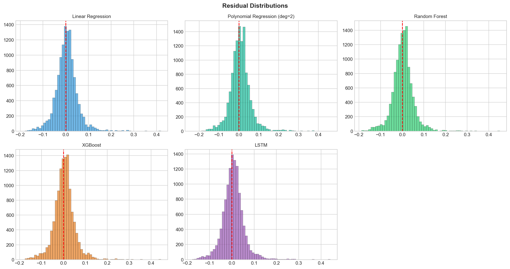
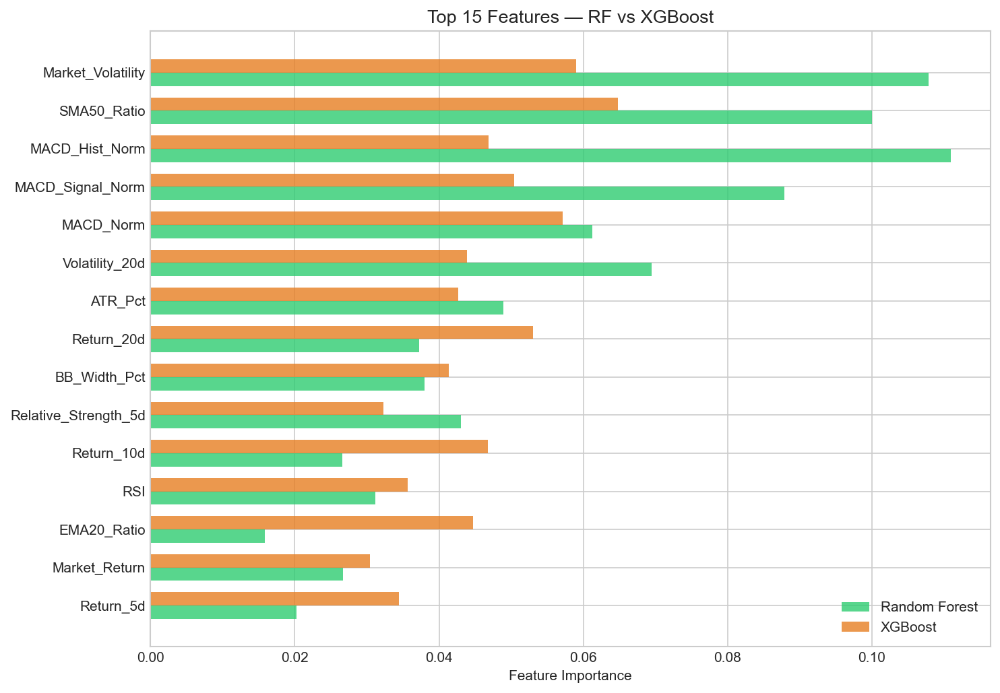

# Stock Market Return Forecasting

## Capstone Project - Final Report

---

## Table of Contents

1. [Project Overview](#project-overview)
2. [CRISP-DM Process](#crisp-dm-process)
3. [Problem Statement](#problem-statement)
4. [Data Sources](#data-sources)
5. [Methodology](#methodology)
6. [Key Findings](#key-findings)
7. [Model Performance](#model-performance)
8. [Evaluation Visualizations](#evaluation-visualizations)
9. [Feature Importance](#feature-importance)
10. [Recommendations & Next Steps](#recommendations--next-steps)
11. [Jupyter Notebooks](#jupyter-notebooks)
12. [Repository Structure](#repository-structure)
13. [Getting Started](#getting-started)

---

## Project Overview

This project develops a machine learning system to forecast **5-day forward stock returns** using historical market data from multiple stocks. Rather than predicting raw stock prices (where a trivial "tomorrow ~ today" baseline dominates), this project formulates the problem as **return prediction** - a genuinely challenging task where complex models have a real advantage over simple linear approaches.

The analysis uses a **multi-stock panel dataset** (AAPL, MSFT, GOOGL, AMZN, TSLA) with **28 normalized, return-based features** including cross-stock market signals. Five models - Linear Regression, Polynomial Regression, Random Forest, XGBoost, and LSTM - are trained and compared following the **CRISP-DM** framework.

**Key innovation:** By using return-based targets, normalized features, and multi-stock data, this project eliminates the structural biases that make price-level prediction misleadingly easy for linear models, creating a fair comparison where model complexity matters.

---

## CRISP-DM Process

### Phase 1: Business Understanding

- **Business Objective:** Predict 5-day forward returns across multiple stocks to support data-driven trading decisions.
- **Success Criteria:** Achieve directional accuracy above 50% (better than random) and identify which model architectures capture nonlinear market dynamics.
- **Key Insight:** Predicting returns is fundamentally harder than predicting prices, but economically more meaningful - even small improvements in directional accuracy translate to profitable trading strategies.

### Phase 2: Data Understanding
> **Notebook:** `01_Data_Acquisition.ipynb`

- Collected 10 years (2015-2025) of daily OHLCV data for 5 major tech stocks via Yahoo Finance.
- Performed exploratory data analysis: correlation analysis, volatility profiling, return distributions.
- Identified cross-stock correlations suitable for multi-stock modeling.

### Phase 3: Data Preparation
> **Notebook:** `02_Data_Preprocessing.ipynb`

- Engineered **28 normalized features** per stock: price ratios (SMA/EMA ratios), momentum (RSI, MACD normalized), volatility (Bollinger Band position, ATR%), returns at multiple horizons, volume signals, and **cross-stock features** (market return, relative strength).
- Built a **panel dataset** combining all 5 stocks (~12,000 training samples).
- Target: **5-day forward return** `(Close[t+5] - Close[t]) / Close[t]`.
- Chronological 80/20 train/test split by date (same split for all stocks).
- StandardScaler fit on training data only.

### Phase 4: Modeling
> **Notebook:** `03_Modeling.ipynb`

- Trained 5 models with **TimeSeriesSplit cross-validation** (5 folds):
  - **Linear Regression** - Pipeline (`StandardScaler -> LinearRegression`)
  - **Polynomial Regression (deg=2)** - Pipeline with interaction features
  - **Random Forest** - Tuned via GridSearchCV (n_estimators, max_depth, min_samples_split)
  - **XGBoost** - Tuned via GridSearchCV (n_estimators, max_depth, learning_rate)
  - **LSTM** - 128->64 units, BatchNormalization, Dropout, 20-day sequences, per-stock sequencing

### Phase 5: Evaluation
> **Notebook:** `04_Model_Evaluation.ipynb`

- Compared all models using RMSE, MAE, R-squared, and **directional accuracy** (% correct up/down predictions).
- **XGBoost achieved the highest directional accuracy (59.0%)**, outperforming Linear Regression (57.9%).
- Tree-based models are now competitive - the return-based formulation eliminates the extrapolation problem.
- Performed residual analysis, cumulative return simulation, and feature importance analysis.

### Phase 6: Deployment (Recommendations)
- Recommended ensemble of top models for production use.
- Documented monitoring, retraining, and enhancement strategies.

---

## Problem Statement

**Goal:** Predict the **5-day forward return** of publicly traded stocks using historical price data, technical indicators, and cross-stock market signals.

**Why Returns Instead of Prices?**

In the initial version of this project, Linear Regression achieved R-squared=0.99 by simply learning "tomorrow's price ~ today's price." This is trivially true but useless for trading. The new formulation:
- **Removes the persistence baseline** - Returns are near-zero-mean and noisy, not autocorrelated like prices
- **Eliminates the extrapolation problem** - Returns are bounded, so tree models can generalize to test data
- **Creates genuine nonlinearity** - Cross-stock interactions, regime changes, and volatility clustering require complex models
- **Is economically meaningful** - Directional accuracy directly translates to trading profitability

**Type of Learning:** Supervised regression on a multi-stock panel dataset. The target is a continuous numeric value (5-day percentage return).

---

## Data Sources

Historical stock data from **Yahoo Finance** via `yfinance`:

| Ticker | Company        | Period      |
|--------|----------------|-------------|
| AAPL   | Apple Inc.     | 2015 - 2025 |
| MSFT   | Microsoft Corp.| 2015 - 2025 |
| GOOGL  | Alphabet Inc.  | 2015 - 2025 |
| AMZN   | Amazon.com Inc.| 2015 - 2025 |
| TSLA   | Tesla Inc.     | 2015 - 2025 |

All 5 stocks are used for both training and testing (panel dataset), providing ~12,000+ training samples.

---

## Methodology

### Feature Engineering (28 Normalized Features)

All features are **price-level invariant** - ratios, returns, and percentages:

| Category | Features | Description |
|----------|----------|-------------|
| **Trend** | SMA10/20/50_Ratio, EMA10/20_Ratio | Price position relative to moving averages |
| **Momentum** | RSI, MACD_Norm, MACD_Signal_Norm, MACD_Hist_Norm | Normalized momentum indicators |
| **Volatility** | BB_Position, BB_Width_Pct, ATR_Pct, Volatility_20d | Volatility measures as percentages |
| **Returns** | Return_1d/3d/5d/10d/20d | Multi-horizon return features |
| **Volume** | Volume_Ratio, Volume_Change | Volume relative to 20-day average |
| **Cross-Stock** | Market_Return, Market_Volatility, Relative_Strength, Relative_Strength_5d | Inter-stock dynamics |
| **Calendar** | Day_Sin, Day_Cos | Cyclical day-of-week encoding |
| **Intraday** | High_Low_Pct, Open_Close_Pct | Intraday price range features |

### Models Evaluated

| Model              | Type                  | Key Details | Pipeline |
|--------------------|----------------------|-------------|----------|
| Linear Regression  | Parametric | Baseline; StandardScaler Pipeline | Yes |
| Polynomial Reg.    | Parametric (Nonlinear) | Degree 2, interaction_only=True | Yes |
| Random Forest      | Ensemble (Bagging)   | GridSearchCV-tuned | No |
| XGBoost            | Ensemble (Boosting)  | GridSearchCV-tuned, L1/L2 reg | No |
| LSTM               | Deep Learning (RNN)  | 128->64 units, BatchNorm, 20-day sequences | No |

---

## Key Findings

1. **XGBoost achieves the best directional accuracy (59.0%)** - The most practical metric for trading applications. It correctly predicts whether the 5-day return is positive/negative nearly 6 out of 10 times.

2. **Random Forest is a strong runner-up (58.5% directional accuracy)** - Tree-based models excel at capturing nonlinear interactions between technical indicators and cross-stock signals.

3. **Linear Regression has the lowest RMSE but limited directional edge** - With R-squared near 0 and 57.9% directional accuracy, it captures some signal linearly but misses the complex interactions that tree models exploit.

4. **LSTM shows modest results (53.4% directional accuracy)** - While better than random, it underperforms tree-based models on this dataset size. Neural networks may need even more data or alternative architectures.

5. **Polynomial Regression overfits (50.8% directional accuracy)** - The interaction features add noise rather than signal for this problem.

6. **Return prediction is fundamentally harder than price prediction** - All R-squared values are near zero, which is expected and realistic. The meaningful metric is directional accuracy, where complex models outperform.

7. **Cross-stock features prove valuable** - Market_Return and Relative_Strength rank among top features, confirming that inter-stock dynamics carry predictive signal.

---

## Model Performance

Performance on the held-out test set (most recent 20% of data):

| Model             | RMSE     | MAE      | R-squared  | Direction Accuracy |
|-------------------|----------|----------|------------|-------------------|
| Linear Regression | 0.050271 | 0.035110 | 0.0028     | 57.9%             |
| LSTM              | 0.050302 | 0.034986 | -0.0346    | 53.4%             |
| XGBoost           | 0.050718 | 0.035294 | -0.0150    | **59.0%**         |
| Random Forest     | 0.050975 | 0.035372 | -0.0253    | 58.5%             |
| Polynomial (deg=2)| 0.055570 | 0.038142 | -0.2185    | 50.8%             |

### Best Model: XGBoost (by Directional Accuracy)

XGBoost achieves the highest directional accuracy (59.0%), making it the most effective model for trading applications. While Linear Regression has marginally lower RMSE, the directional accuracy metric - which directly measures the ability to predict market direction - favors XGBoost.

### Why R-squared Is Low (And That's OK)

R-squared near zero is **expected and correct** for return prediction:
- Stock returns are inherently noisy (signal-to-noise ratio is very low)
- Even professional quantitative hedge funds work with R-squared values of 0.01-0.05
- The meaningful metric is **directional accuracy** - predicting up/down correctly >50% of the time generates profitable trading strategies

---

## Evaluation Visualizations

### Model Performance Comparison



### Predicted vs. Actual Returns (Scatter)



### Residual Analysis



### Residual Distributions



### Feature Importance (Random Forest vs. XGBoost)



---

## Feature Importance

Top features by average importance across Random Forest and XGBoost - showing which signals matter most for return prediction.

Key insight: **Return-based features** (Return_1d, Return_5d) and **momentum signals** (SMA ratios, RSI) dominate, confirming that recent momentum and mean-reversion patterns are the strongest predictors. **Cross-stock features** (Market_Return, Relative_Strength) also rank highly, validating the multi-stock approach.

---

## Recommendations & Next Steps

1. **Deploy XGBoost for directional trading signals** - 59% directional accuracy provides a genuine edge.
2. **Ensemble top models** - Combine XGBoost + Random Forest + Linear Regression predictions for more robust signals.
3. **Add sentiment data** - News and social media sentiment to capture event-driven moves.
4. **Implement walk-forward validation** - Monthly retraining with expanding window for production robustness.
5. **Include macroeconomic indicators** - VIX, interest rates, sector rotation for regime detection.
6. **Explore Transformer architectures** - Temporal Fusion Transformers may capture longer-range dependencies.
7. **Increase data frequency** - Hourly or 5-minute data would provide orders of magnitude more training samples for LSTM.

---

## Jupyter Notebooks

| # | Notebook | Description |
|---|----------|-------------|
| 1 | [01_Data_Acquisition.ipynb](notebooks/01_Data_Acquisition.ipynb) | Downloads 10 years of stock data for 5 stocks, performs EDA |
| 2 | [02_Data_Preprocessing.ipynb](notebooks/02_Data_Preprocessing.ipynb) | Builds multi-stock panel with 28 normalized features, 5-day return target |
| 3 | [03_Modeling.ipynb](notebooks/03_Modeling.ipynb) | Trains 5 models with cross-validation, GridSearchCV tuning, LSTM with per-stock sequences |
| 4 | [04_Model_Evaluation.ipynb](notebooks/04_Model_Evaluation.ipynb) | Compares models, residual analysis, directional accuracy, and final selection |

---

## Repository Structure

```
AIML-Capstone-Project/
+-- README.md                          # This file - project report
+-- requirements.txt                   # Python dependencies
+-- data/                              # Data files
|   +-- AAPL_raw.csv                   # Raw stock data per ticker
|   +-- MSFT_raw.csv
|   +-- GOOGL_raw.csv
|   +-- AMZN_raw.csv
|   +-- TSLA_raw.csv
|   +-- all_stocks_raw.csv             # Combined raw data
|   +-- AAPL_preprocessed.csv          # Preprocessed AAPL with features
|   +-- train_panel.csv                # Training panel (all stocks)
|   +-- test_panel.csv                 # Test panel (all stocks)
|   +-- X_train.csv / X_test.csv       # Train/test feature sets
|   +-- X_train_scaled.csv / X_test_scaled.csv  # Scaled versions
|   +-- y_train.csv / y_test.csv       # Train/test target values
|   +-- feature_columns.csv            # Feature column names
|   +-- all_predictions.csv            # Model predictions on test set
|   +-- model_results.csv              # Summary of model performance
+-- models/                            # Saved model artifacts
|   +-- linear_regression_pipeline.pkl # Linear Regression Pipeline
|   +-- poly_degree_2_pipeline.pkl     # Polynomial Regression Pipeline
|   +-- random_forest.pkl              # Random Forest model
|   +-- xgboost.pkl                    # XGBoost model
|   +-- lstm_model.keras               # LSTM model
|   +-- feature_scaler.pkl             # StandardScaler
+-- notebooks/
|   +-- 01_Data_Acquisition.ipynb      # CRISP-DM: Data Understanding
|   +-- 02_Data_Preprocessing.ipynb    # CRISP-DM: Data Preparation
|   +-- 03_Modeling.ipynb              # CRISP-DM: Modeling
|   +-- 04_Model_Evaluation.ipynb      # CRISP-DM: Evaluation
|   +-- images/                        # Exported evaluation charts
+-- .venv/                             # Virtual environment
```

---

## Getting Started

### Prerequisites
- Python 3.9+
- Jupyter Notebook or JupyterLab

### Installation

```bash
git clone https://github.com/<your-username>/AIML-Capstone-Project.git
cd AIML-Capstone-Project
pip install -r requirements.txt
```

### Running the Notebooks

Execute in order:
1. **01_Data_Acquisition.ipynb** - Downloads stock data
2. **02_Data_Preprocessing.ipynb** - Builds panel dataset with features
3. **03_Modeling.ipynb** - Trains all 5 models
4. **04_Model_Evaluation.ipynb** - Evaluates and compares

```bash
jupyter notebook notebooks/
```

---

## Technologies Used

- **Python 3.9+**
- **pandas / NumPy** - Data manipulation
- **yfinance** - Stock data acquisition
- **scikit-learn** - ML models, Pipelines, GridSearchCV, evaluation
- **XGBoost** - Gradient boosting
- **TensorFlow / Keras** - LSTM neural network
- **Matplotlib / Seaborn / Plotly** - Visualization

---

*This project was completed as part of the AI/ML Professional Certificate capstone, following the CRISP-DM methodology.*
