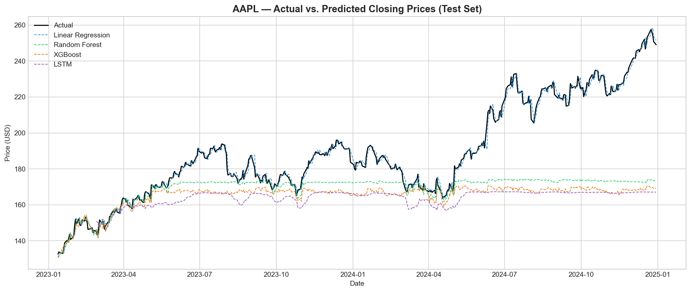

# Stock Price Forecasting Application

## Capstone Project — Final Report

---

## Table of Contents

1. [Project Overview](#project-overview)
2. [CRISP-DM Process](#crisp-dm-process)
3. [Problem Statement](#problem-statement)
4. [Data Sources](#data-sources)
5. [Methodology](#methodology)
6. [Key Findings](#key-findings)
7. [Model Performance](#model-performance)
8. [Evaluation Visualizations](#evaluation-visualizations)
9. [Feature Importance](#feature-importance)
10. [Recommendations & Next Steps](#recommendations--next-steps)
11. [Repository Structure](#repository-structure)
12. [Getting Started](#getting-started)

---

## Project Overview

This project develops a machine learning system to forecast stock closing prices using historical market data. Accurate stock price prediction is a valuable yet challenging task in the financial industry. By applying multiple regression-based machine learning models to historical stock data enriched with technical indicators, this project evaluates which algorithms are best suited for short-term stock price forecasting.

The analysis covers the full data science lifecycle following the **CRISP-DM (Cross-Industry Standard Process for Data Mining)** framework: business understanding, data understanding, data preparation, modeling, evaluation, and deployment considerations. Four distinct models — Linear Regression, Random Forest, XGBoost, and LSTM (Long Short-Term Memory) neural network — are trained and compared to identify the most effective approach.

---

## CRISP-DM Process

This project follows the **CRISP-DM** methodology, the industry-standard framework for data mining and machine learning projects. Each phase maps directly to the project notebooks:

### Phase 1: Business Understanding
> **Notebook:** Context & planning across all notebooks

- **Business Objective:** Predict next-day closing prices for publicly traded stocks to support data-driven investment decisions.
- **Success Criteria:** Achieve R² > 0.95 and RMSE within acceptable bounds relative to stock price levels.
- **Stakeholders:** Individual investors, portfolio managers, and quantitative analysts who need reliable short-term price forecasts.
- **Constraints:** Only historical price/volume data available (no sentiment, news, or macroeconomic data in this iteration).

### Phase 2: Data Understanding
> **Notebook:** `01_Data_Acquisition.ipynb`

- Collected 10 years (2015–2025) of daily OHLCV data for 5 major tech stocks via Yahoo Finance.
- Performed exploratory data analysis: correlation analysis, trend identification, volatility profiling, and distribution analysis of daily returns.
- Identified AAPL as the primary modeling target due to high liquidity and representative price behavior.
- Key insight: All five tech stocks showed moderate-to-high correlation, with TSLA exhibiting the highest volatility.

### Phase 3: Data Preparation
> **Notebook:** `02_Data_Preprocessing.ipynb`

- Cleaned data using forward-fill/backward-fill for missing values; verified data integrity (High ≥ Low, no negatives).
- Engineered 25 technical indicator features: moving averages (SMA, EMA), momentum (RSI), trend (MACD), volatility (Bollinger Bands, ATR), lag features, and return metrics.
- Applied chronological 80/20 train/test split (~2,014 training / ~502 test samples) to preserve temporal ordering and prevent data leakage.
- Scaled features using StandardScaler (fit on training data only).

### Phase 4: Modeling
> **Notebook:** `03_Modeling.ipynb`

- Trained four diverse algorithms spanning parametric, ensemble, and deep learning categories:
  - **Linear Regression** — Simple baseline assuming linear feature-target relationships
  - **Random Forest** (n_estimators=200, max_depth=15) — Ensemble bagging for non-linear patterns
  - **XGBoost** (n_estimators=300, learning_rate=0.05, L1/L2 regularization) — Gradient boosting with sequential error correction
  - **LSTM** (2 layers: 64→32 units, dropout=0.2, 30-day sequences) — Deep learning for temporal dependencies
- Saved all trained models and generated predictions on the test set.

### Phase 5: Evaluation
> **Notebook:** `04_Model_Evaluation.ipynb`

- Compared all models using RMSE, MAE, and R² on the held-out test set.
- Performed residual analysis, error distribution analysis, and predicted-vs-actual scatter plots.
- **Linear Regression emerged as the best model** with R² = 0.9909, dramatically outperforming tree-based and deep learning alternatives.
- Conducted feature importance analysis across Random Forest and XGBoost.

### Phase 6: Deployment (Recommendations)
> **Notebook:** `04_Model_Evaluation.ipynb` — conclusions section

- Documented deployment considerations: daily error monitoring, monthly retraining, walk-forward validation.
- Recommended enhancements: sentiment analysis integration, macroeconomic indicators, transformer architectures.
- The selected Linear Regression model is lightweight, interpretable, and suitable for production deployment.

---

## Problem Statement

**Goal:** Predict the next-day closing price of publicly traded stocks using historical price and volume data enriched with technical indicators.

**Challenges:**
- Stock markets are inherently volatile and influenced by countless external factors (news, sentiment, macroeconomic events) that are difficult to quantify.
- Historical price data alone may not capture all drivers of price movement.
- Overfitting is a significant risk — models may learn noise rather than true patterns.

**Potential Benefits:**
- Provide data-driven insights to support investment decision-making.
- Identify which technical features carry the most predictive signal.
- Establish a baseline forecasting framework that can be extended with additional data sources (e.g., sentiment analysis, macroeconomic indicators).

**Type of Learning:** This is a **supervised learning regression** problem. The target variable is the next-day closing price (a continuous numeric value), and the models are trained on labeled historical data.

---

## Data Sources

Historical stock data is sourced from **Yahoo Finance** via the `yfinance` Python library. Data is collected for five major technology stocks:

| Ticker | Company        | Period      |
|--------|----------------|-------------|
| AAPL   | Apple Inc.     | 2015 – 2025 |
| MSFT   | Microsoft Corp.| 2015 – 2025 |
| GOOGL  | Alphabet Inc.  | 2015 – 2025 |
| AMZN   | Amazon.com Inc.| 2015 – 2025 |
| TSLA   | Tesla Inc.     | 2015 – 2025 |

Each record includes: Open, High, Low, Close, Adjusted Close, and Volume.

**Apple (AAPL)** is used as the primary stock for detailed modeling and evaluation, while the broader dataset provides context for exploratory analysis and correlation studies.

---

## Methodology

### Data Preprocessing
- Checked for and handled missing values using forward-fill and interpolation.
- Engineered 25 technical indicator features including:
  - Simple & Exponential Moving Averages (SMA_10, SMA_20, SMA_50, EMA_10, EMA_20)
  - Relative Strength Index (RSI, 14-day)
  - Moving Average Convergence Divergence (MACD, MACD_Signal, MACD_Histogram)
  - Bollinger Bands (BB_Upper, BB_Lower, BB_Width)
  - Average True Range (ATR, 14-day)
  - Lag features (Close_Lag1, Close_Lag3, Close_Lag5)
  - Daily return, rolling volatility, High_Low_Pct, Open_Close_Pct
- Split data using an **80/20 time-based split** (no random shuffling to preserve temporal order).
- Scaled features using `StandardScaler` (fit on training data only to prevent leakage).

### Models Evaluated

| Model              | Type                  | Key Hyperparameters                                           |
|--------------------|----------------------|---------------------------------------------------------------|
| Linear Regression  | Parametric Regression | Default (simple baseline)                                     |
| Random Forest      | Ensemble (Bagging)   | n_estimators=200, max_depth=15, min_samples_split=5           |
| XGBoost            | Ensemble (Boosting)  | n_estimators=300, learning_rate=0.05, max_depth=6, L1/L2 reg  |
| LSTM               | Deep Learning (RNN)  | 2 layers (64→32), dropout=0.2, 30-day sequences, early stopping |

---

## Key Findings

1. **Linear Regression is the clear winner** — Achieving R² = 0.9909 with RMSE of only $2.60, it dramatically outperforms all other models on this dataset.
2. **Tree-based models (Random Forest, XGBoost) significantly underperform** with negative R² scores, indicating they fail to generalize beyond the training distribution for this time-series task.
3. **LSTM does not provide an advantage** — Despite being designed for sequential data, it performs worst among all models (R² = -0.999), likely because lag features already encode the temporal information LSTM tries to learn.
4. **Lag features and moving averages are the most influential predictors** — SMA_10, Close_Lag1, and BB_Lower rank as the top features, confirming that recent price history carries strong predictive signal.
5. **Simplicity wins for stock forecasting** — The strong linear relationship between recent technical indicators and next-day price favors a straightforward linear model over complex non-linear approaches.

---

## Model Performance

Performance evaluated on the held-out test set (20% of data, most recent period: Jan 2023 – Dec 2024):

| Model             | RMSE     | MAE      | R² Score   | Test Samples |
|-------------------|----------|----------|------------|--------------|
| **Linear Regression** | **2.5966**  | **1.9166**  | **0.9909**    | 494          |
| Random Forest     | 30.1438  | 20.4727  | -0.2296    | 494          |
| XGBoost           | 33.5177  | 24.1689  | -0.5203    | 494          |
| LSTM              | 35.9844  | 28.0683  | -0.9992    | 464          |

### Best Model: Linear Regression ⭐

| Metric                  | Value       |
|-------------------------|-------------|
| RMSE                    | $2.5966     |
| MAE                     | $1.9166     |
| R² Score                | 0.9909      |
| Mean Error              | $0.1162     |
| Median Error            | $0.1820     |
| Std of Error            | $2.5966     |
| Max Overshoot           | -$11.51     |
| Max Undershoot          | +$14.70     |
| Mean % Error            | 0.0494%     |
| Mean Absolute % Error   | 1.0214%     |

Linear Regression achieves a mean absolute percentage error of just ~1%, making it highly reliable for next-day price forecasting.

---

## Evaluation Visualizations

The following visualizations were generated during model evaluation (Notebook 04):

### Model Performance Comparison

Bar chart comparing RMSE, MAE, and R² across all four models. Linear Regression dominates with the lowest error metrics and highest R² score by a wide margin.


### Predictions vs. Actual Prices (Time Series)

Interactive time-series overlay showing actual AAPL closing prices against each model's predictions over the test period (Jan 2023 – Dec 2024). Linear Regression tracks the actual price closely, while other models show systematic underprediction at higher price levels.



### Predicted vs. Actual Scatter Plots

Scatter plots with perfect-prediction reference lines for each model. Linear Regression points cluster tightly along the diagonal (R² = 0.991), while Random Forest, XGBoost, and LSTM show flattening — predicting values within a narrow range regardless of actual price.


### Residual Analysis

Residual plots for all four models. Linear Regression residuals are centered around zero with no systematic pattern, confirming unbiased predictions. Tree-based and LSTM models show severe positive bias (systematic underprediction).


### Residual Distributions

Histogram of residuals for each model. Linear Regression shows a near-normal distribution centered at zero (mean = 0.116). Other models show heavily right-skewed distributions with means of 20–28, indicating large systematic errors.


### Feature Importance (Random Forest vs. XGBoost)

Horizontal bar chart comparing feature importance across tree-based models:

| Rank | Feature     | Avg. Importance |
|------|-------------|-----------------|
| 1    | SMA_10      | 0.1684          |
| 2    | Close_Lag1  | 0.1115          |
| 3    | BB_Lower    | 0.1035          |
| 4    | Close_Lag3  | 0.1000          |
| 5    | High        | 0.0972          |
| 6    | EMA_20      | 0.0623          |
| 7    | Low         | 0.0619          |
| 8    | SMA_50      | 0.0615          |
| 9    | SMA_20      | 0.0533          |
| 10   | Close       | 0.0517          |


### Model Rankings

| Model             | RMSE Rank | MAE Rank | R² Rank | Average Rank |
|-------------------|-----------|----------|---------|--------------|
| Linear Regression | 1         | 1        | 1       | **1.0**      |
| Random Forest     | 2         | 2        | 2       | 2.0          |
| XGBoost           | 3         | 3        | 3       | 3.0          |
| LSTM              | 4         | 4        | 4       | 4.0          |

---

## Feature Importance

The top 10 most predictive features (averaged across Random Forest and XGBoost importance scores):

1. **SMA_10** (10-day Simple Moving Average) — 0.1684
2. **Close_Lag1** (Previous day close) — 0.1115
3. **BB_Lower** (Bollinger Band lower bound) — 0.1035
4. **Close_Lag3** (3-day lagged close) — 0.1000
5. **High** (Daily high price) — 0.0972
6. **EMA_20** (20-day Exponential Moving Average) — 0.0623
7. **Low** (Daily low price) — 0.0619
8. **SMA_50** (50-day Simple Moving Average) — 0.0615
9. **SMA_20** (20-day Simple Moving Average) — 0.0533
10. **Close** (Closing price) — 0.0517

**Key Insight:** Moving averages and lag features dominate, confirming that recent price history is the strongest predictor of next-day price. The 10-day SMA is the single most important feature, suggesting that the short-term trend direction is highly predictive.

---

## Recommendations & Next Steps

1. **Incorporate Sentiment Analysis** — Integrate news headlines or social media sentiment (e.g., Twitter/X, Reddit) as additional features to capture market mood.
2. **Add Macroeconomic Indicators** — Include features like interest rates, CPI, and unemployment data that influence broader market trends.
3. **Implement Walk-Forward Validation** — Use expanding or sliding window cross-validation for more robust time-series evaluation.
4. **Deploy as a Web Application** — Build a Streamlit or Flask app to serve real-time predictions to end users.
5. **Monitor for Data Drift** — Track model performance over time and retrain periodically as market regimes change.
6. **Explore Transformer Architectures** — Recent advances in transformer-based models (e.g., Temporal Fusion Transformers) show promise for time-series forecasting.
7. **Investigate Tree-Based Model Failures** — The poor generalization of Random Forest and XGBoost warrants further investigation, potentially with walk-forward retraining or different feature sets.

---

## Repository Structure

```
AIML-Capstone-Project/
├── README.md                          # This file — project report with results
├── requirements.txt                   # Python dependencies
├── .gitignore                         # Git ignore rules
├── data/                              # Data files (committed for reproducibility)
│   ├── AAPL_raw.csv                   # Raw AAPL historical data
│   ├── AAPL_preprocessed.csv          # Preprocessed AAPL data with features
│   ├── all_stocks_raw.csv             # Combined raw data for all 5 stocks
│   ├── MSFT_raw.csv                   # Raw stock data per ticker
│   ├── GOOGL_raw.csv
│   ├── AMZN_raw.csv
│   ├── TSLA_raw.csv
│   ├── X_train.csv / X_test.csv       # Train/test feature sets
│   ├── X_train_scaled.csv / X_test_scaled.csv  # Scaled versions
│   ├── y_train.csv / y_test.csv       # Train/test target values
│   ├── feature_columns.csv            # Feature column names
│   ├── all_predictions.csv            # Model predictions on test set
│   └── model_results.csv              # Summary of model performance metrics
├── models/                            # Saved model artifacts
│   ├── linear_regression.pkl          # Trained Linear Regression model
│   ├── random_forest.pkl              # Trained Random Forest model
│   ├── xgboost.pkl                    # Trained XGBoost model
│   ├── lstm_model.keras               # Trained LSTM model
│   └── feature_scaler.pkl             # StandardScaler for feature normalization
├── notebooks/
│   ├── 01_Data_Acquisition.ipynb      # CRISP-DM: Data Understanding
│   ├── 02_Data_Preprocessing.ipynb    # CRISP-DM: Data Preparation
│   ├── 03_Modeling.ipynb              # CRISP-DM: Modeling
│   └── 04_Model_Evaluation.ipynb      # CRISP-DM: Evaluation
└── notebooks/images/                  # Exported evaluation charts
```

---

## Getting Started

### Prerequisites

- Python 3.9+
- Jupyter Notebook or JupyterLab

### Installation

```bash
# Clone the repository
git clone https://github.com/<your-username>/AIML-Capstone-Project.git
cd AIML-Capstone-Project

# Install dependencies
pip install -r requirements.txt
```

### Running the Notebooks

Execute the notebooks in order:

1. **01_Data_Acquisition.ipynb** — Downloads stock data and performs initial exploration.
2. **02_Data_Preprocessing.ipynb** — Cleans data and engineers features.
3. **03_Modeling.ipynb** — Trains all four models.
4. **04_Model_Evaluation.ipynb** — Evaluates and compares model performance.

```bash
jupyter notebook notebooks/
```

---

## Technologies Used

- **Python 3.9+**
- **pandas** — Data manipulation
- **NumPy** — Numerical computing
- **yfinance** — Stock data acquisition
- **scikit-learn** — Machine learning models and evaluation
- **XGBoost** — Gradient boosting
- **TensorFlow / Keras** — LSTM neural network
- **Matplotlib / Seaborn / Plotly** — Visualization

---

*This project was completed as part of the AI/ML Professional Certificate capstone, following the CRISP-DM methodology.*
